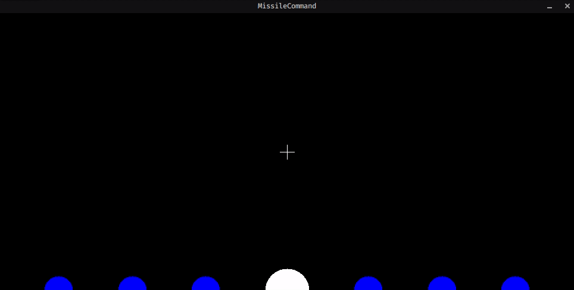

# gym_missile_command

Open AI Gym environment of the [Missile Command Atari game](https://en.wikipedia.org/wiki/Missile_Command).



## What for?

To easily train and test different bots on the Missile Command Atari game.
Gym environments are well designed for Reinforcement Learning algorithms.
This environment does not reproduce an exact version of the Missile Command Atari game but a simplified one.

## Game

The player musts defend 6 cities from incoming enemy ballistic missiles.
To do so, he can fire missiles from an anti-missiles battery.
An episode ends when all enemy missiles or cities are destroyed.

- The anti-missiles battery can not be destroyed.
- There are no levels, all episodes have the same difficulty.
- Enemy missiles do not have an explosion radius and do not split.

## Reward

The reward is one of the most decisive value for the success of a Reinforcement Learning algorithm.
The reward depends on several variables, each one contributing to a specific wanted skill of the engine.

- Number of cities destroyed, to protect the cities.
- Number of enemy missiles destroyed, to improve accuracy.
- Number of missiles launched, to minimize the use of missiles.

## Installation

[Python](https://www.python.org/) 3.6+ is required.
The installation is done with the following commands.

```shell
git clone https://github.com/ElieKadoche/gym_missile_command.git
pip install -e ./gym_missile_command
```
## Usage

2 examples are given.
To use them, simply use the following commands.
For a human to play, commands are: arrow keys to move the target and space to fire a missile.

```shell
python -m gym_missile_command.examples.random_agent  # For a random agent to play
python -m gym_missile_command.examples.human_agent  # For a human to play
```

## Configuration

When creating a Missile Command environment, one can create a custom configuration.
The object `custom_config` is a dictionary containing a custom configuration.
Keys are the attributes and values are... Well, the custom values.
To see the whole customizable configuration, see [./gym_missile_command/config.py](./gym_missile_command/config.py).
Below is an example.

```python
import gym

# Custom configuration, empty for no changes
custom_config = {"ENEMY_MISSILES.NUMBER": 42,
                 "FRIENDLY_MISSILES.EXPLOSION_RADIUS": 17}

# Create the environment
env = gym.make("gym_missile_command:missile-command-v0",
               custom_config=custom_config)
```

## Development

The entire environment is simulated with Numpy arrays.
Distances, collisions, movements, etc., of objects are computed without any `for` loops of Python, but with Numpy operations.
Numpy being well optimized in C++, it (hopefully) makes this environment fast.

The only `for` loops used is the environment are present in the `render` functions.
The `opencv-python` library is used to generate the pixels of the current image of the environment.
OpenCV being well optimized in C++, it (hopefully) does not slow too much the computations.

## Authors

- Elie KADOCHE.
